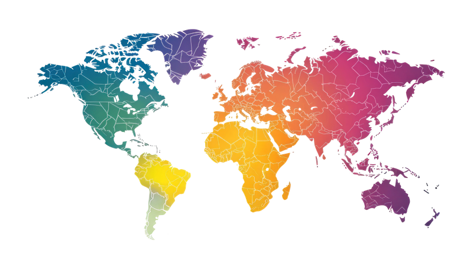

# 🚁 Drone Delivery Tracking UI

A futuristic delivery tracking frontend using drone animation – built with HTML, CSS, and JavaScript.

## 🔥 Features
- Interactive animated drone flying over map
- Clean and modern UI
- Responsive design
- Built from scratch
- Designed by **Piyush Joshi**

## 🖼️ Preview

## 🌐 Live Demo
[Click here](https://piyush2707.github.io/Drone-Delivery-Ui/)

---

## 📁 Tech Used
- HTML5
- CSS3 (Animations & Layout)
- JavaScript

---

## 🙋‍♂️ Author
**Piyush Joshi**

- LinkedIn: [piyush2707](https://www.linkedin.com/in/piyush2707/)
- Instagram: `@withpiyushhz

---

⭐ Feel free to fork & give a ⭐ if you liked it!
